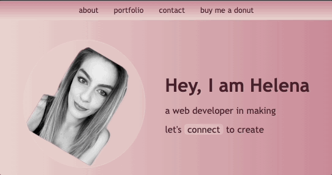

## Table of contents

- [Overview](#overview)
- [The challenge](#the-challenge)
- [Portfolio Demo](#portfolio-demo)
- [Links](#links)
- [My process](#my-process)
- [Built with](#built-with)
- [What I learned](#what-i-learned)
- [Continued development](#continued-development)
- [Useful resources](#useful-resources)
- [Author](#author)
- [Acknowledgments](#acknowledgments)

## Overview

This challenge was completed to consolidate this week's learnings (flexbox, CSS grid, media queries, and CSS variables) and create my portfolio page to showcase my skills and talents to potential employers.

I will build on this as I progress through my bootcamp course.

## The Challenge

I was given some critical requirements neccessary to develop a portfolio that satisfies a typical hiring manager’s needs:

- When the page is loaded the page presents your name, a recent photo or avatar, and links to sections about you, your work, and how to contact you
- When one of the links in the navigation is clicked then the UI scrolls to the corresponding section
- When viewing the section about your work then the section contains titled images of your applications
- When presented with the your first application then that application's image should be larger in size than the others
- When images of the applications are clicked then the user is taken to that deployed application
- When the page is resized or viewed on various screens and devices then the layout is responsive and adapts to my viewport

## Portfolio Demo

The following animation shows the web aplication's appearance:



## Links

You will be able to see my portfolio page URL if you navigate into Settings → Pages inside this repository.

Or, click on this link: [Helena's Portfolio Page](https://cyberrie.github.io/challenge2-portfolio/)

## My Process

I have started working on my portfolio page last week, so slightly ahead of the schedule.

I have used pen and paper to sketch my initial layout.

For my main layout, I have decided to use flexbox and grid nested within portfolio section of my page. I now understand this can be built using grid layout fully, however as I have started slightly earlier, I felt more comfortable with flexbox.

## Built with...

- Semantic HTML5 markup
- CSS custom properties
- Flexbox
- CSS Grid
- Desktop-first workflow

## What I learned

With this particular challenge, I have used flexbox nested within another flexbox container in my contact section.

I was struggling to work out on how to make a nested flexbox take the full width in a flex item which was its container.

In the end, I realised I have used width property on a wrong element, nested flex as opposed to outer flex container.

```css
.outer-flex-container {
  width: 100%;
}
```

## Continued development

I will use Excalidraw to sketch my future projects as it is easy to use and it can be lie edited with the group if working on the same project.

I will continue working on enhancing my skills in CSS grid and start using it more often in my application as it needs less code.

I will aim to build future applications with mobile-first approach as data suggests this is more preferred way as more websites are now looked up on mobile devices and it is easier to build on simpler layouts rather than working backwards from omplex layouts.

## Useful Resources

- [HTML Semantic Elements](https://www.w3schools.com/html/html5_semantic_elements.asp) - This was a nice refresher I kept open during the initial stages to ensure I apply these in my project.

- [A Complete Guide to Flexbox](https://css-tricks.com/snippets/css/a-guide-to-flexbox/) - This is an amazing article which helped me finally understand flexbox. The good thing is that you can try it out yourself on the side.

- [A Complete Guide to CSS Grid](https://css-tricks.com/snippets/css/complete-guide-grid/) - Have a look here if ou would like ot grasp the concpt of CSS grid quickly!

## Author

©️ Helena Gilja

- Website - [Helena - Web Developer](https://cyberrie.github.io/helenagilja-portfolio/)

- GitHub - [cyberrie](https://github.com/cyberrie)

## Acknowledgments

🌟 I would like to thank our bootcamp instructor Dane for this week's sessions and explaining flexbox and grid concepts really well.

🌟 Special thanks to TAs Scott, Noah & Asha who helped me resolve some of the challenges during this project.
